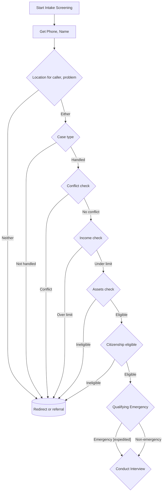

# VLAS Intake Bot

This project is a Pipecat-AI/FastAPI-based intake-bot that integrates with Twilio to provide real-time phone-based communication.

## Intake-bot control flow diagram:

```mermaid
flowchart TD
    start[Start Intake Screening]
    get_phone_name[Get Phone, Name]
    location{Location for caller, problem}
    exit[(Redirect or referral)]
    case_type{Case type}
    check_conflict{Conflict check}
    check_income{Income check}
    check_assets{Assets check}
    check_citizenship{Citizenship eligible}
    check_emergency{Qualifying Emergency}
    conduct_interview{Conduct Interview}


    start --> get_phone_name
    get_phone_name --> location
    location -- Neither --> exit
    location -- Either --> case_type
    case_type -- Handled --> check_conflict
    case_type -- Not handled --> exit
    check_conflict -- Conflict --> exit
    check_conflict -- No conflict --> check_income
    check_income -- Under limit --> check_assets
    check_income -- Over limit --> exit
    check_assets -- Eligible --> check_citizenship
    check_assets -- Ineligible --> exit
    check_citizenship -- Eligible --> check_emergency
    check_citizenship -- Ineligible --> exit
    check_emergency -- Emergency [expedited] --> conduct_interview
    check_emergency -- Non-emergency --> conduct_interview

```
