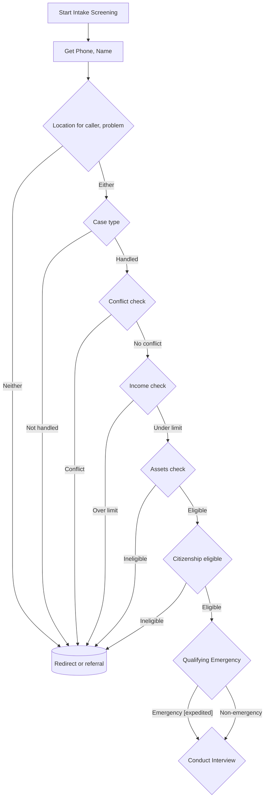

# VLAS Intake Bot

This project is a Pipecat-AI/FastAPI-based intake-bot that integrates with Twilio to provide real-time phone-based communication.

## Intake-bot control flow diagram:



## Secret Key
You will need to provide a 64 character hexidecimal secret key. You can generate one with the following methods:

Using openssl:
```
openssl rand −hex 32
```

Using python:
```python
import secrets
print(secrets.token_hex(32))
```

## Development

1. Set up:
```
uv sync --group dev
```

2. Activate the Python `.venv` (depends on your system)

3. Run the server with reload:
```
granian intake_bot.server:app --interface asgi --host 0.0.0.0 --port 8765 --reload --reload-paths ./src/intake_bot
```

4. Install the local websocket test client:
```
cd ./client/typescript
npm install
```

5. Run the local websocket test client (from project root):
```
npm run --prefix ./client/typescript dev -- --port 5173
```

6. Install the Whisker (Pipecat) debugger:
```
cd ./debug/ui
npm install
```

7. Run the Whisker (Pipecat) debugger (from project root):
```
npm run --prefix ./debug/ui dev -- --port 5174
```
