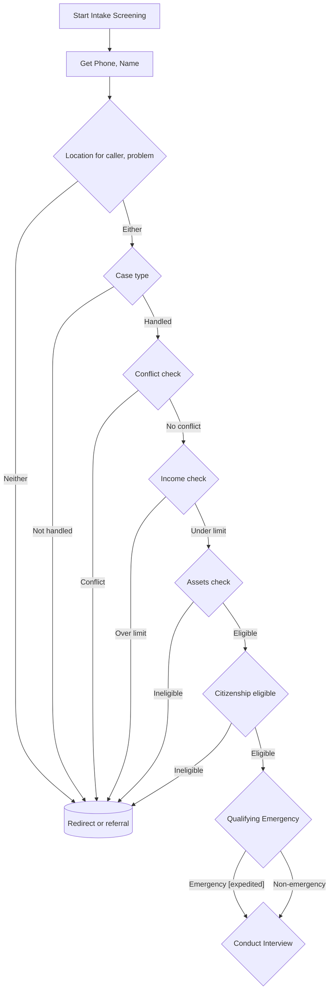

# VLAS Intake Bot

This project is a Pipecat-AI/FastAPI-based intake-bot that integrates with Twilio to provide real-time phone-based communication.

## Intake-bot control flow diagram:



## Secret Key
You will need to provide a 64 character hexadecimal secret key. You can generate one with the following methods:

Using openssl:
```
openssl rand −hex 32
```

Using python:
```python
import secrets
print(secrets.token_hex(32))
```

## Development

1. **Set up:**
```
uv sync --group dev
```

2. **Activate the Python `.venv` (depends on your system)**

3. **Copy and rename the `.env.dist` file to `.env` and fill it out.**

4. **Run the server with reload:**
```
granian intake_bot.server:app --interface asgi --host 0.0.0.0 --port 8765 --reload --reload-paths ./src/intake_bot
```

5. **Install the local websocket test client:**
```
cd ./client/typescript
npm install
```

6. **Run the local websocket test client (from project root):**
```
npm run --prefix ./client/typescript dev -- --port 5174
```

7. **Run the Whisker (Pipecat) debugger:**
    #### 🌐 Option A: Use the hosted UI (Recommended)

    1. **Expose your local server with ngrok:**
    ```bash
    ngrok http 9090
    ```
    2. **Copy the ngrok URL** (e.g., `your-ngrok-url.ngrok.io`)

    3. **Open the hosted Whisker UI:** [https://whisker.pipecat.ai/](https://whisker.pipecat.ai/)

    4. **Connect to your bot:**
    - In the WebSocket URL field, enter: `wss://your-ngrok-url.ngrok.io`
    - Click connect

    #### 🏠 Option B: Run the UI locally

    If you prefer to run the UI locally:

    1. **Clone the repository:**

    ```bash
    git clone https://github.com/pipecat-ai/whisker.git
    ```

    2. **Start the UI:**

    ```bash
    cd whisker/ui
    npm install
    npm run dev
    ```

    3. **Connect to [http://localhost:5173](http://localhost:5173)**

    The UI will automatically connect to `ws://localhost:9090` by default.
