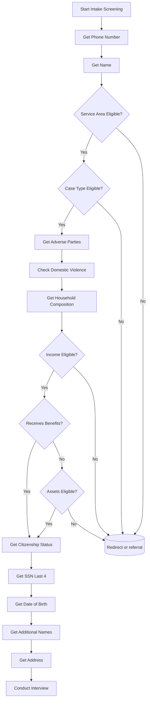

# VLAS Intake Bot

This project is a Pipecat-AI/FastAPI-based intake-bot that integrates with Twilio to provide real-time phone-based communication.

## Intake-bot control flow diagram:


```mermaid
flowchart TD
    start[Start Intake Screening]
    get_phone[Get Phone Number]
    get_name[Get Name]
    location{Service Area Eligible?}
    exit[(Redirect or referral)]
    case_type{Case Type Eligible?}
    adverse_parties[Get Adverse Parties]
    domestic_violence[Check Domestic Violence]
    household[Get Household Composition]
    check_income{Income Eligible?}
    check_benefits{Receives Benefits?}
    check_assets{Assets Eligible?}
    get_citizenship[Get Citizenship Status]
    get_ssn[Get SSN Last 4]
    get_dob[Get Date of Birth]
    get_address[Get Address]
    get_addl_names[Get Additional Names]
    conduct_interview[Conduct Interview]

    start --> get_phone
    get_phone --> get_name
    get_name --> location
    location -- Yes --> case_type
    location -- No --> exit
    case_type -- Yes --> adverse_parties
    case_type -- No --> exit
    adverse_parties --> domestic_violence
    domestic_violence --> household
    household --> check_income
    check_income -- Yes --> check_benefits
    check_income -- No --> exit
    check_benefits -- Yes --> get_citizenship
    check_benefits -- No --> check_assets
    check_assets -- Yes --> get_citizenship
    check_assets -- No --> exit
    get_citizenship --> get_ssn
    get_ssn --> get_dob
    get_dob --> get_addl_names
    get_addl_names --> get_address
    get_address --> conduct_interview
```

## Federal Poverty Scale
The Federal Poverty Scale data is static and will need to be manually updated each year. The included json file `federal_poverty_scale.json` comes from the [docassemble-PovertyScale](https://github.com/SuffolkLITLab/docassemble-PovertyScale?tab=readme-ov-file) project and the file itself is [here](https://github.com/SuffolkLITLab/docassemble-PovertyScale/blob/main/docassemble/PovertyScale/data/sources/federal_poverty_scale.json).

## Secret Key
You will need to provide a 64 character hexadecimal secret key. You can generate one with the following methods:

Using openssl:
```
openssl rand −hex 32
```

Using python:
```python
import secrets
print(secrets.token_hex(32))
```

## Development

1. **Set up:**
```
uv sync --group dev
```

2. **Activate the Python `.venv` (depends on your system)**

3. **Copy and rename the `.env.dist` file to `.env` and fill it out.**

4. **Run the server with reload:**
```
granian intake_bot.server:app --interface asgi --host 0.0.0.0 --port 8765 --reload --reload-paths ./src/intake_bot
```

5. **Install the local websocket test client:**
```
cd ./client/typescript
npm install
```

6. **Run the local websocket test client (from project root):**
```
npm run --prefix ./client/typescript dev -- --port 5174
```

7. **Run Pipecat Tail (monitor):**
    #### ⚡ Option A: Pipeline runner

    Enable Pipecat Tail directly in your server console by setting `ENABLE_TAIL_RUNNER=TRUE` in your `.env`.

    #### 🏠 Option B: Standalone app

    You can also start Tail as a standalone application. This lets you connect to a running session, whether local or remote.

    Enable Pipecat Tail connectivity by setting `ENABLE_TAIL_OBSERVER=TRUE` in your `.env`.

    Install the Pipecat-CLI:
    ```sh
    uv tool install pipecat-ai-cli
    ```

    Then start the app:

    ```sh
    pipecat tail [--url URL]
    ```

    By default, it will connect to `ws://localhost:9292`.

8. **Run Pipecat Whisker (debugger):**
    #### 🌐 Option A: Use the hosted UI (Recommended)

    1. **Expose your local server with ngrok:**
    ```bash
    ngrok http 9090
    ```
    2. **Copy the ngrok URL** (e.g., `your-ngrok-url.ngrok.io`)

    3. **Open the hosted Whisker UI:** [https://whisker.pipecat.ai/](https://whisker.pipecat.ai/)

    4. **Connect to your bot:**
    - In the WebSocket URL field, enter: `wss://your-ngrok-url.ngrok.io`
    - Click connect

    #### 🏠 Option B: Run the UI locally

    If you prefer to run the UI locally:

    1. **Clone the repository:**

    ```bash
    git clone https://github.com/pipecat-ai/whisker.git
    ```

    2. **Start the UI:**

    ```bash
    cd whisker/ui
    npm install
    npm run dev
    ```

    3. **Connect to [http://localhost:5173](http://localhost:5173)**

    The UI will automatically connect to `ws://localhost:9090` by default.
