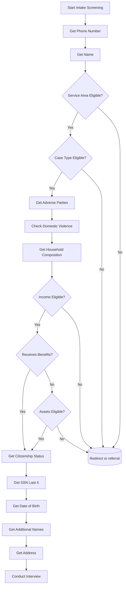

# VLAS Intake Bot

This project has two local entrypoints:

- `bot.py` for Daily and Pipecat Cloud runtime flows
- `server.py` for local websocket testing

The production telephony path uses Daily PSTN dial-in. Local websocket testing does not use Twilio.

## Intake-bot control flow diagram


```mermaid
flowchart TD
    start[Start Intake Screening]
    get_phone[Get Phone Number]
    get_name[Get Name]
    location{Service Area Eligible?}
    exit[(Redirect or referral)]
    case_type{Case Type Eligible?}
    adverse_parties[Get Adverse Parties]
    domestic_violence[Check Domestic Violence]
    household[Get Household Composition]
    check_income{Income Eligible?}
    check_benefits{Receives Benefits?}
    check_assets{Assets Eligible?}
    get_citizenship[Get Citizenship Status]
    get_ssn[Get SSN Last 4]
    get_dob[Get Date of Birth]
    get_address[Get Address]
    get_addl_names[Get Additional Names]
    conduct_interview[Conduct Interview]

    start --> get_phone
    get_phone --> get_name
    get_name --> location
    location -- Yes --> case_type
    location -- No --> exit
    case_type -- Yes --> adverse_parties
    case_type -- No --> exit
    adverse_parties --> domestic_violence
    domestic_violence --> household
    household --> check_income
    check_income -- Yes --> check_benefits
    check_income -- No --> exit
    check_benefits -- Yes --> get_citizenship
    check_benefits -- No --> check_assets
    check_assets -- Yes --> get_citizenship
    check_assets -- No --> exit
    get_citizenship --> get_ssn
    get_ssn --> get_dob
    get_dob --> get_addl_names
    get_addl_names --> get_address
    get_address --> conduct_interview
```

## Federal Poverty Scale

The Federal Poverty Scale data is static and will need to be manually updated each year. The included json file `federal_poverty_scale.json` comes from the [docassemble-PovertyScale](https://github.com/SuffolkLITLab/docassemble-PovertyScale?tab=readme-ov-file) project and the [file itself is here](https://github.com/SuffolkLITLab/docassemble-PovertyScale/blob/main/docassemble/PovertyScale/data/sources/federal_poverty_scale.json).

## Development

1. Set up:

    ```bash
    uv sync --group dev
    ```

1. Activate the Python `.venv` (depends on your system)

1. Copy and rename the `.env.dist` file to `.env` and fill it out.

1. Run the bot locally with Daily PSTN dial-in support:

    ```bash
    uv run bot.py -t daily --dialin
    ```

1. Run the local websocket server for browser or automated client testing:

    ```bash
    uv run uvicorn server:app --host 0.0.0.0 --port 8765 --reload
    ```

1. Run the restored browser websocket client:

    ```bash
    npm run --prefix ./client/typescript dev -- --port 5174
    ```

1. Run the Python websocket test client:

    ```bash
    python ./client/python/client.py
    ```

1. Expose the local dial-in webhook during development:

    ```bash
    ngrok http 7860
    ```

   Set your Daily dial-in `room_creation_api` to:

   `https://<your-ngrok-domain>/daily-dialin-webhook`

1. Production on Pipecat Cloud:

    - Deploy this bot to Pipecat Cloud using the `pcc-deploy.toml`.

    Pipecat Cloud handles inbound dial-in webhook lifecycle and room creation for PSTN calls.

Azure OpenAI notes:

- The bot LLM now uses Azure OpenAI via your deployment name in `AZURE_LLM_MODEL`.
- `AZURE_LLM_ENDPOINT` should be the Azure resource root such as `https://your-resource-name.openai.azure.com`, not an API path like `/openai/v1/`.
- The bot STT now uses Azure Speech via `AZURE_SPEECH_REGION`.
- After the caller chooses Spanish, the bot updates Azure STT to `es-US` for the remainder of the call.
- The classifier's Azure providers default to using `AZURE_LLM_MODEL` unless you set model-specific deployment overrides.

The root `server.py` file is only for local websocket testing and is intentionally not copied into the Docker image.

## Troubleshooting

- If deployment logs show `Invalid Daily dial-in request` with missing `dialin_settings`, `daily_api_key`, or `daily_api_url`, the Daily number is usually pointing at the wrong endpoint. The automatic Pipecat Cloud setup must use the `/dialin` webhook endpoint above, not a generic agent start endpoint.
- If you run your own webhook server, forward Daily's `callId` and `callDomain` as `body.dialin_settings` when you start the Pipecat Cloud agent, and make sure `DAILY_API_KEY` is available to the bot runtime.
- To probe the current auto dial-in webhook using the active Daily pinless config and HMAC, run `python scripts/probe_daily_dialin_webhook.py --phone-number +18049899200`. Use `--dry-run` to inspect the signed request without sending it.

1. Run Pipecat Tail (monitor):

   - ⚡ Option A: Pipeline runner

        Enable Pipecat Tail directly in your server console by setting `ENABLE_TAIL_RUNNER=TRUE` in your `.env`.

   - 🏠 Option B: Standalone app

        You can also start Tail as a standalone application. This lets you connect to a running session, whether local or remote.

        Enable Pipecat Tail connectivity by setting `ENABLE_TAIL_OBSERVER=TRUE` in your `.env`.

        Install the Pipecat-CLI:

        ```bash
        uv tool install pipecat-ai-cli
        ```

        Then start the app:

        ```bash
        pipecat tail [--url URL]
        ```

        By default, it will connect to `ws://localhost:9292`.

1. Run Pipecat Whisker (debugger):

   - 🌐 Option A: Use the hosted UI (Recommended)

        1. Expose your local server with ngrok:

            ```bash
            ngrok http 9090
            ```

        1. Copy the ngrok URL (e.g., `your-ngrok-url.ngrok.io`)

        1. Open the hosted Whisker UI: [https://whisker.pipecat.ai/](https://whisker.pipecat.ai/)

        1. Connect to your bot:
            - In the WebSocket URL field, enter: `wss://your-ngrok-url.ngrok.io`
            - Click connect

   - 🏠 Option B: Run the UI locally

        1. Clone the repository:

            ```bash
            git clone https://github.com/pipecat-ai/whisker.git
            ```

        1. Start the UI:

            ```bash
            cd whisker/ui
            npm install
            npm run dev
            ```

        1. Connect to [http://localhost:5173](http://localhost:5173)

            The UI will automatically connect to `ws://localhost:9090` by default.
